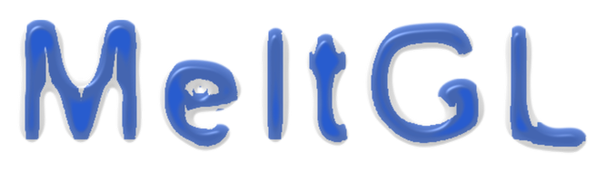
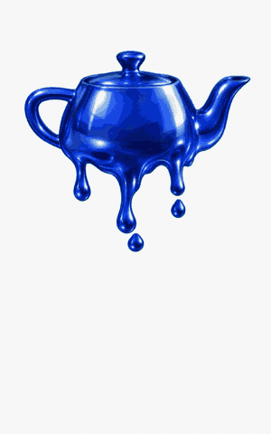

<p align="center">
  
</p>

<p align="center">
  
  
  
  
</p>

MeltGL melts images and video in the browser. The picture is not warped or scrolled downwards. It is
treated as a body of material, and the material is run through a fluid solver on the GPU: heat lowers its
viscosity, gravity pulls it down, surface tension rounds the drops, and the outline of the picture moves
because the material under it moved.

That last part is the whole point. A warp can only push pixels around inside the shape it started with, so
the silhouette never changes and nothing ever really drips. Here the silhouette is what the solver is
solving for, which is why drops swell, neck, and let go on their own.

There is a live demo at [1etu.github.io/MeltGL](https://1etu.github.io/MeltGL/). Drop a picture or a video
of your own on the box and pull the sliders around.

## The melt

Eight seconds of the slime preset, recorded from the demo page at 20 frames per second. There is also an
[MP4](Website/demo-slime.mp4) if you prefer that.

<p align="center">
  
</p>

## Using it

```js
import { createMelt } from 'meltgl'

const melt = await createMelt({
  target: document.querySelector('#poster'),
  source: 'teapot.png',
  material: 'wax',
  duration: 8
})

melt.play()
melt.on('complete', () => location.href = '/next')
```

The target is any element. MeltGL puts its own canvas over it and leaves the element alone, and the canvas
runs past the bottom edge so the material has somewhere to fall. The source is an ``, a `<video>`, a
URL to either, or your own object that hands back frames. Materials are `wax`, `honey`, `chocolate`,
`tar`, `solder` and `slime`, or a preset with any of its numbers changed.

Besides `play` there is `reverse`, `pause`, `seek`, `reset`, `configure` and `dispose`, and they all do
what their names say. Scrubbing works because the solver keeps periodic snapshots and replays from the
nearest one.

MeltGL is not on npm yet. Clone the repository and run `pnpm install` then `pnpm build`, or take the
prebuilt module out of `Website/` and load it straight from a page. `pnpm dev` opens the demo, which is the
fastest way to get a feel for the parameters.

## How it works

The engine is a two dimensional free surface Navier-Stokes solver, following Carlson and others from 2002.
Temperature drives viscosity over about four decades, so the same code covers a solid that barely creeps
and a liquid that runs off the screen. Each substep advects the fields, applies heat and gravity and a
curvature force at the surface, solves viscosity implicitly because an explicit solve is not stable at that
stiffness, projects the velocity to remove divergence with a multigrid V-cycle, and puts the level set that
carries the outline back into shape.

The picture itself rides on a reference map, which is a second field holding the material coordinate each
cell started from. The image is sampled through that map when the frame is shaded, so it stretches with the
material and never turns to mush the way repeated resampling would.

A 360 by 360 melt holds 60 frames per second on a discrete GPU. Fields run at a fraction of the canvas
resolution by default while the picture is always shaded at full resolution, which is where most of that
headroom comes from.

Browsers without WebGL 2 and float render targets fall back to an SVG filter. It is a displacement warp of
the source, not a simulation, and it honours only the material's viscosity, density and tension plus the
noise and timing options. It looks like something melting from across the room. Do not expect it to match.

## Credits

This is a small implementation of other people's ideas. It would not exist without these.

- Carlson, Mucha, Van Horn, Turk. [Melting and Flowing](https://dl.acm.org/doi/10.1145/545261.545289). SCA 2002. Solids as very high viscosity fluid, viscosity from temperature, implicit viscous step. The model this engine uses.
- Terzopoulos, Platt, Fleischer. [Heating and Melting Deformable Models](http://web.cs.ucla.edu/~dt/papers/vca91a/vca91a.pdf). 1989, 1991. The first melting model in graphics.
- Paiva, Petronetto, Lewiner, Tavares. [Particle-based non-Newtonian fluid animation for melting objects](https://thomas.lewiner.org/pdfs/melt_sibgrapi.pdf), 2006, and [Particle-based viscoplastic fluid/solid simulation](https://thomas.lewiner.org/pdfs/plastic_cad.pdf), 2009. Temperature dependent viscoplastic viscosity.
- Stomakhin, Schroeder, Jiang, Chai, Teran, Selle. [Augmented MPM for phase-change and varied materials](https://math.ucdavis.edu/~jteran/papers/SSJCTS14.pdf). SIGGRAPH 2014.
- Batty, Bridson. [Accurate Viscous Free Surfaces for Buckling, Coiling, and Rotating Liquids](https://www.cs.ubc.ca/~rbridson/docs/batty-sca08-viscosity.pdf). SCA 2008. Why viscosity must be implicit and what the free surface condition costs.
- Stam. [Stable Fluids](https://people.computing.clemson.edu/~dhouse/courses/817/papers/stam99.pdf). SIGGRAPH 1999. Semi-Lagrangian advection and the projection step.
- Sussman, Smereka, Osher. [A Level Set Approach for Computing Solutions to Incompressible Two-Phase Flow](https://doi.org/10.1006/jcph.1994.1155). JCP 1994. The level set and its reinitialisation.
- Russo, Smereka. [A Remark on Computing Distance Functions](https://doi.org/10.1006/jcph.2000.6560). JCP 2000. The subcell fix that keeps thin features from eroding.
- Brackbill, Kothe, Zemach. [A continuum method for modeling surface tension](https://doi.org/10.1016/0021-9991(92)90240-Y). JCP 1992. The curvature force on the interface band.
- Papanastasiou. [Flows of Materials with Yield](https://doi.org/10.1122/1.549926). J. Rheology 1987. The regularised yield stress.
- Diez, Kondic. [Contact line instabilities of thin liquid films](https://pubmed.ncbi.nlm.nih.gov/11177899/). PRL 2001. Why the thin film model was the wrong one for a melting body.
- Zhu, Quigley, Cong, Solomon, Fedkiw. [Codimensional surface tension flow on simplicial complexes](https://dl.acm.org/doi/10.1145/2601097.2601201). SIGGRAPH 2014. Bergou, Audoly, Vouga, Wardetzky, Grinspun. [Discrete viscous threads](https://dl.acm.org/doi/10.1145/1833349.1778853). SIGGRAPH 2010. Drops, filaments, pinch off.
- Wang, Mucha, Turk. [Water Drops on Surfaces](https://faculty.cc.gatech.edu/~turk/my_papers/droplet.pdf). SIGGRAPH 2005. Contact angles, not implemented yet.
- Paulun, Kawabe, Nishida, Fleming. [Seeing liquids from static snapshots](https://pubmed.ncbi.nlm.nih.gov/25676882/). Vision Research 2015. van Assen, Barla, Fleming. [Visual Features in the Perception of Liquids](https://pmc.ncbi.nlm.nih.gov/articles/PMC5807092/). Current Biology 2018. Kawabe, Maruya, Fleming, Nishida. [Seeing liquids from visual motion](https://pubmed.ncbi.nlm.nih.gov/25102388/). Vision Research 2015. What people actually look at when they judge a liquid, which is why the outline has to move.
- Material numbers: [honey viscosity](https://www.sciencedirect.com/science/article/abs/pii/S0260877405000208), [paraffin viscosity](https://wiki.anton-paar.com/en/paraffin-wax/), [chocolate Casson yield](https://iopscience.iop.org/article/10.1088/1755-1315/355/1/012041/pdf).

## License

MIT. Reports and patches are welcome on the [issue tracker](https://github.com/1etu/meltgl/issues).
